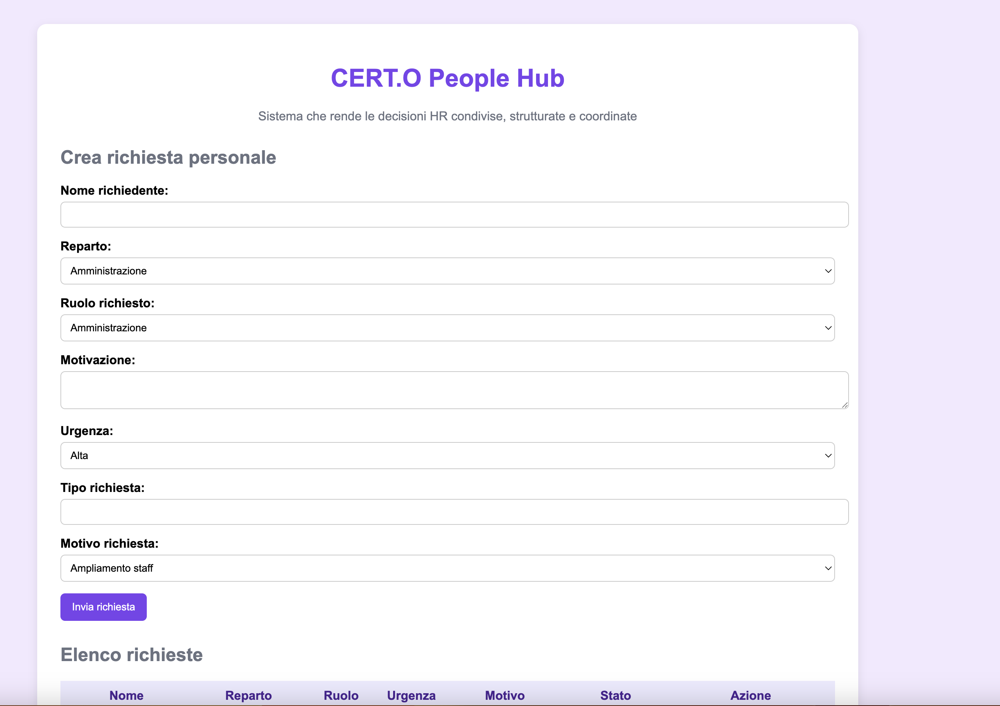
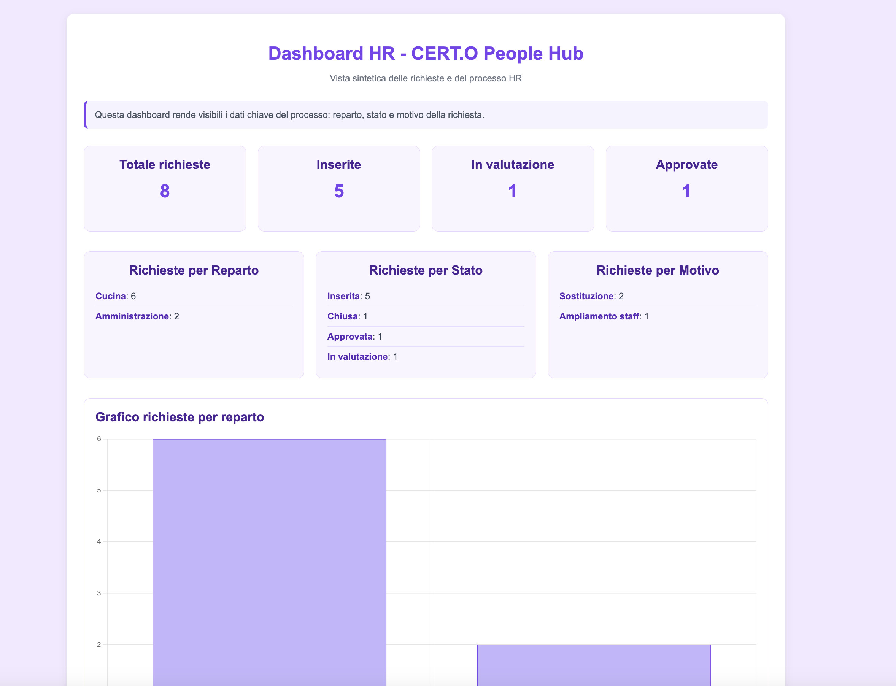

# CERT.O People Hub

CERT.O People Hub è un progetto nato da un’esigenza molto concreta: portare chiarezza nelle decisioni HR all’interno delle PMI.

In molti contesti operativi, soprattutto nella ristorazione, le richieste di personale nascono da urgenze reali ma non sempre analizzate:
“serve qualcuno subito”.

Questo progetto nasce proprio per trasformare queste situazioni in un processo strutturato, tracciabile e condiviso.

---

## 🎯 Obiettivo

Supportare HR e management nel passaggio da decisioni reattive a decisioni più consapevoli, basate su dati e criteri chiari.

Non si tratta solo di digitalizzare, ma di introdurre un modo diverso di ragionare sul fabbisogno di personale.

---

## ⚙️ Cosa fa il sistema

- gestisce l’organico aziendale per reparto e ruolo  
- confronta risorse attuali e risorse previste (Gap Analysis)  
- permette l’inserimento di richieste di personale in modo strutturato  
- guida il processo attraverso stati (inserita, validata, approvata, attivata)  
- integra una logica decisionale basata sul Metodo CERT.O  

---

## 🧠 Logica del progetto

Il progetto si basa su un concetto semplice:

> l’HR Business Partner non è solo una persona, ma può diventare un sistema.

Attraverso una piattaforma condivisa, il processo decisionale viene distribuito tra più ruoli, mantenendo coerenza e tracciabilità.

---

## 🔄 Flusso operativo

1. Inserimento della richiesta di personale  
2. Analisi del fabbisogno (contesto e dati)  
3. Validazione HR  
4. Approvazione o rifiuto  
5. Attivazione del processo di recruiting  

---

## 📊 Perché è utile

- riduce decisioni basate su percezioni  
- migliora il dialogo tra operativo e HR  
- rende il fabbisogno più leggibile e confrontabile  
- introduce un primo livello di analisi dati nelle PMI  

---

## 🛠️ Tecnologie utilizzate

- Python  
- Django  
- SQLite  

---

## 🚀 Sviluppi futuri

- dashboard HR con KPI  
- integrazione con strumenti di analisi dati (Python / Pandas)  
- estensione al ciclo completo HR (recruiting, onboarding, performance)  

---

## 👤 Autrice

Federica De Angelis

## 📸 Anteprima progetto

